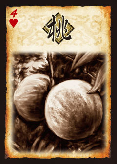
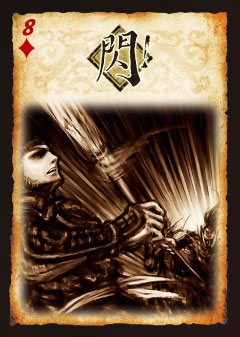
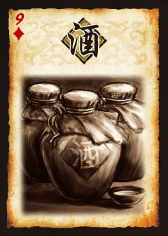
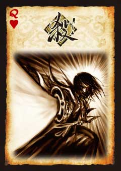
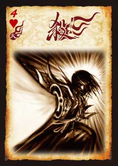
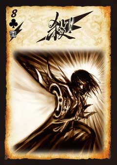
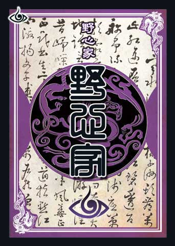

# 三国杀国战 游戏牌详细信息

> 本文档整理三国杀国战模式全部游戏牌的详细规则信息。
> 数据来源：[三国杀国战官网卡牌一览](https://guozhan.sanguosha.com/a/kapaiyilan/youxipai/jibenpai/2013/0130/149.html)
> 卡牌图片存放在 `images/` 子目录中。

---

## 一、基本牌

---

### 1.1 桃

| 属性 | 内容 |
|------|------|
| 卡牌名称 | 【桃】 |
| 卡牌种类 | 基本牌 |
| 出牌时机 | 1、出牌阶段。2、有角色处于濒死状态时。 |
| 使用目标 | 1、你。2、处于濒死状态的一名角色。 |
| 作用效果 | 目标角色回复1点体力。 |
| 卡牌数量 | 8 |
| 卡牌分布 | ♦2 ♥4 ♥6 ♥7 ♥8 ♥9 ♥10 ♥Q |

**其他说明：**
- ★例如，一名角色的剩余体力为2点，此时受到【闪电】造成的3点伤害，此时该角色处于濒死状态，该角色或其他任何人合计需使用2张【桃】才能救回（2－3＋2＝1）。
- ★出牌阶段，若你没有损失体力，你不可以对自己使用【桃】。

---

### 1.2 闪

| 属性 | 内容 |
|------|------|
| 卡牌名称 | 【闪】 |
| 卡牌种类 | 基本牌 |
| 出牌时机 | 以你为目标的【杀】开始结算时。 |
| 使用目标 | 以你为目标的【杀】。 |
| 作用效果 | 抵消目标【杀】的效果。 |
| 卡牌数量 | 14 |
| 卡牌分布 | ♦2 ♦3 ♦6 ♦7×2 ♦8×2 ♦9 ♦10 ♦J ♦K ♥2 ♥J ♥K |

**其他说明：**
- ★闪通常情况下只能在回合外使用或打出。
- ★响应锦囊"万箭齐发"时，可打出闪。
- ★响应武将技能"如曹操护驾"时，可打出闪。

---

### 1.3 酒

| 属性 | 内容 |
|------|------|
| 卡牌名称 | 【酒】 |
| 卡牌种类 | 基本牌 |
| 出牌时机 | 出牌阶段 |
| 使用目标 | 自己 |
| 作用效果 | 1、出牌阶段对自己使用，令本回合下一张【杀】所造成的伤害+1（一回合只能使用一次）。 2、当你处于濒死状态时，对自己使用，立即回复1点体力（不能对他人使用【酒】）。 |
| 卡牌数量 | 3 |
| 卡牌分布 | ♦9 ♠9 ♣9 |

---

### 1.4 杀

| 属性 | 内容 |
|------|------|
| 卡牌名称 | 【杀】 |
| 卡牌种类 | 基本牌 |
| 出牌时机 | 出牌阶段 |
| 使用目标 | 除你以外，你攻击范围内的任意一名角色。 |
| 作用效果 | 【杀】对目标角色造成1点伤害。 |
| 卡牌数量 | 21 |
| 卡牌分布 | ♦J ♦10 ♦Q ♠7 ♠8×2 ♠9 ♠10 ♠J ♥10 ♥Q ♣3 ♣4 ♣5 ♣7 ♣8 ♣9 ♣10 ♣J |

**其他说明：**
- ★游戏初始攻击范围是1。
- ★响应锦囊牌"借刀杀人"时，可使用杀。
- ★每个出牌阶段你只能使用一张【杀】。
- ★响应锦囊牌"决斗"时，可打出杀。
- ★响应锦囊牌"南蛮入侵"时，可打出杀。
- ★响应武将技能"如刘备激将"时，可使用或打出杀。

---

### 1.5 火杀

| 属性 | 内容 |
|------|------|
| 卡牌名称 | 【火杀】 |
| 卡牌种类 | 基本牌 |
| 出牌时机 | 出牌阶段 |
| 使用目标 | 除你以外，你攻击范围内的任意一名角色。 |
| 作用效果 | 【杀】对目标角色造成1点伤害。 |
| 卡牌数量 | 3 |
| 卡牌分布 | ♦4 ♦5 ♥4 |

**其他说明：**
- ★游戏初始攻击范围是1。
- ★响应锦囊牌"借刀杀人"时，可使用杀。
- ★每个出牌阶段你只能使用一张【杀】。
- ★响应锦囊牌"决斗"时，可打出杀。
- ★响应锦囊牌"南蛮入侵"时，可打出杀。
- ★响应武将技能"如刘备激将"时，可使用或打出杀。

---

### 1.6 雷杀

| 属性 | 内容 |
|------|------|
| 卡牌名称 | 【雷杀】 |
| 卡牌种类 | 基本牌 |
| 出牌时机 | 出牌阶段 |
| 使用目标 | 除你以外，你攻击范围内的任意一名角色。 |
| 作用效果 | 【杀】对目标角色造成1点伤害。 |
| 卡牌数量 | 5 |
| 卡牌分布 | ♠7 ♠6 ♣6 ♣7 ♣8 |

**其他说明：**
- ★游戏初始攻击范围是1。
- ★响应锦囊牌"借刀杀人"时，可使用杀。
- ★每个出牌阶段你只能使用一张【杀】。
- ★响应锦囊牌"决斗"时，可打出杀。
- ★响应锦囊牌"南蛮入侵"时，可打出杀。
- ★响应武将技能"如刘备激将"时，可使用或打出杀。

---

## 二、锦囊牌

---

### 2.1 决斗

| 属性 | 内容 |
|------|------|
| 卡牌名称 | 【决斗】 |
| 卡牌种类 | 锦囊牌 |
| 出牌时机 | 出牌阶段 |
| 使用目标 | 除你以外，任意一名角色。 |
| 作用效果 | 出牌阶段，对一名其他角色使用。由该角色开始，你与其轮流打出一张【杀】，首先不出【杀】的一方受到另一方造成的1点伤害。 |
| 卡牌数量 | 2 |
| 卡牌分布 | ♠A ♣A |

**其他说明：**
- ★使用【决斗】有可能让自己受伤。
- ★受到因【决斗】导致的伤害时，来源为决斗的获胜方。

---

### 2.2 无中生有

| 属性 | 内容 |
|------|------|
| 卡牌名称 | 【无中生有】 |
| 卡牌种类 | 锦囊牌 |
| 出牌时机 | 出牌阶段 |
| 使用目标 | 自己 |
| 作用效果 | 出牌阶段，对自己使用。摸两张牌。 |
| 卡牌数量 | 2 |
| 卡牌分布 | ♥7 ♥8 |

---

### 2.3 过河拆桥

| 属性 | 内容 |
|------|------|
| 卡牌名称 | 【过河拆桥】 |
| 卡牌种类 | 锦囊牌 |
| 出牌时机 | 出牌阶段 |
| 使用目标 | 除你外，任意一名角色。 |
| 作用效果 | 出牌阶段，对一名区域内有牌的其他角色使用。你将其区域内的一张牌弃置。 |
| 卡牌数量 | 3 |
| 卡牌分布 | ♠3 ♠4 ♥Q |

**其他说明：**
- ★尽管目标角色判定区里的牌不属于他/她，你依然可以令他/她弃置那张牌。

---

### 2.4 顺手牵羊

| 属性 | 内容 |
|------|------|
| 卡牌名称 | 【顺手牵羊】 |
| 卡牌种类 | 锦囊牌 |
| 出牌时机 | 出牌阶段 |
| 使用目标 | 除你以外，与你距离1以内的一名角色。 |
| 作用效果 | 出牌阶段，对距离为1且区域内有牌的一名其他角色使用。你获得其区域内的一张牌。 |
| 卡牌数量 | 3 |
| 卡牌分布 | ♦3 ♠3 ♠4 |

**其他说明：**
- ★使用【顺手牵羊】时，注意你装备区里的【马】和目标角色装备区里的【马】。

---

### 2.5 借刀杀人

| 属性 | 内容 |
|------|------|
| 卡牌名称 | 【借刀杀人】 |
| 卡牌种类 | 锦囊牌 |
| 出牌时机 | 出牌阶段 |
| 使用目标 | 除你以外，装备区里有武器牌的一名角色。 |
| 作用效果 | 出牌阶段，对装备区里有武器牌的一名其他角色使用。该角色需对其攻击范围内，由你指定的另一名角色使用一张【杀】，否则将装备区里的武器牌交给你。 |
| 卡牌数量 | 1 |
| 卡牌分布 | ♣Q |

**其他说明：**
- ★A使用【杀】时，角色技能和武器技能可以照常发动。

---

### 2.6 南蛮入侵

| 属性 | 内容 |
|------|------|
| 卡牌名称 | 【南蛮入侵】 |
| 卡牌种类 | 锦囊牌 |
| 出牌时机 | 出牌阶段 |
| 使用目标 | 除你以外的所有角色。 |
| 作用效果 | 出牌阶段，对所有其他角色使用。每名目标角色需打出一张【杀】，否则受到1点伤害。 |
| 卡牌数量 | 2 |
| 卡牌分布 | ♠K ♣7 |

**其他说明：**
- ★你必须指定除你以外的所有角色为目标，然后他们依次（从你的下家开始）选择是否打出【杀】。

---

### 2.7 万箭齐发

| 属性 | 内容 |
|------|------|
| 卡牌名称 | 【万箭齐发】 |
| 卡牌种类 | 锦囊牌 |
| 出牌时机 | 出牌阶段 |
| 使用目标 | 除你以外的所有角色。 |
| 作用效果 | 出牌阶段，对所有其他角色使用。每名目标角色需打出一张【闪】，否则受到1点伤害。 |
| 卡牌数量 | 1 |
| 卡牌分布 | ♥A |

**其他说明：**
- ★你必须指定除你以外的所有角色为目标，然后他们依次（从你的下家开始）选择是否打出【闪】。

---

### 2.8 桃园结义

| 属性 | 内容 |
|------|------|
| 卡牌名称 | 【桃园结义】 |
| 卡牌种类 | 锦囊牌 |
| 出牌时机 | 出牌阶段 |
| 使用目标 | 所有角色 |
| 作用效果 | 出牌阶段，对所有角色使用。每名目标角色回复1点体力。 |
| 卡牌数量 | 1 |
| 卡牌分布 | ♥A |

**其他说明：**
- ★这张牌会让包括你在内的角色各回复1点体力。

---

### 2.9 五谷丰登

| 属性 | 内容 |
|------|------|
| 卡牌名称 | 【五谷丰登】 |
| 卡牌种类 | 锦囊牌 |
| 出牌时机 | 出牌阶段 |
| 使用目标 | 所有角色 |
| 作用效果 | 出牌阶段，对所有角色使用。你从牌堆亮出等同于现存角色数量的牌，每名目标角色选择并获得其中的一张。 |
| 卡牌数量 | 1 |
| 卡牌分布 | ♥3 |

**其他说明：**
- ★这张牌会让包括你在内的角色每人各从一定数量的牌里挑选一张加入手牌。

---

### 2.10 火攻

| 属性 | 内容 |
|------|------|
| 卡牌名称 | 【火攻】 |
| 卡牌种类 | 锦囊牌 |
| 出牌时机 | 出牌阶段 |
| 使用目标 | 一名有手牌的角色。 |
| 作用效果 | 该角色展示一张手牌，然后若你弃置一张与所展示牌相同花色的手牌，则【火攻】对其造成1点火焰伤害。 |
| 卡牌数量 | 2 |
| 卡牌分布 | ♥2 ♥3 |

---

### 2.11 铁索连环

| 属性 | 内容 |
|------|------|
| 卡牌名称 | 【铁索连环】 |
| 卡牌种类 | 锦囊牌 |
| 出牌时机 | 出牌阶段 |
| 使用目标 | 一至两名角色 |
| 作用效果 | 连环——出牌阶段使用，分别横置或重置其武将牌（被横置武将牌的角色处于"连环状态"）。即使第一名受伤害的角色死亡，也会令其它处于连环状态的角色受到该属性伤害。经由连环传导的伤害不能再次被传导。重铸——出牌阶段，你可以将此牌置入弃牌堆，然后摸一张牌。 |
| 卡牌数量 | 3 |
| 卡牌分布 | ♠Q ♣Q ♣K |

---

### 2.12 无懈可击

| 属性 | 内容 |
|------|------|
| 卡牌名称 | 【无懈可击】 |
| 卡牌种类 | 锦囊牌 |
| 出牌时机 | 目标锦囊对目标角色生效前。 |
| 使用目标 | 目标锦囊。 |
| 作用效果 | 抵消目标锦囊对一名角色产生的效果；或抵消另一张无懈可击产生的效果。 |
| 卡牌数量 | 1 |
| 卡牌分布 | ♠J |

**其他说明：**
- ★【无懈可击】是1张可以在其他锦囊开始结算时使用的锦囊，它只能抵消目标锦囊对一名指定角色产生的效果。
- ★【无懈可击】本身也是锦囊，所以也可以被抵消。
- ★当【无懈可击】抵消【闪电】的效果后，【闪电】不会被弃置，而是继续传递给下家（见【闪电】段落）。

---

### 2.13 无懈可击·国

| 属性 | 内容 |
|------|------|
| 卡牌名称 | 【无懈可击·国】 |
| 卡牌种类 | 锦囊牌 |
| 出牌时机 | 目标锦囊对目标角色生效前。 |
| 使用目标 | 目标锦囊。 |
| 作用效果 | 抵消目标锦囊牌对一名角色或一种势力产生的效果，或抵消另一张【无懈可击】产生的效果。 |
| 卡牌数量 | 2 |
| 卡牌分布 | ♦Q ♣K |

**Q&A：**
- [Q]【无懈可击·国】的效果被【无懈可击】抵消时，只抵消对一名角色的效果还是全部抵消？
- [A]全部抵消。
- [Q]使用【南蛮入侵】时，如何使用【无懈可击·国】进行响应？
- [A]在【南蛮入侵】对任意一名目标角色生效前，可以使用【无懈可击·国】抵消其对该角色或与该角色同势力的所有尚未结算完毕的角色产生的效果（即轮到对之后的目标角色进行使用结算时，在生效前效果被抵消）。如果使用的【无懈可击·国】被【无懈可击】抵消，即【无懈可击·国】的所有效果都被抵消。

---

### 2.14 远交近攻

| 属性 | 内容 |
|------|------|
| 卡牌名称 | 【远交近攻】 |
| 卡牌种类 | 锦囊牌 |
| 出牌时机 | 出牌阶段 |
| 使用目标 | 与你势力不同的一名角色 |
| 作用效果 | 出牌阶段，对有明置武将牌且与你势力不同的一名角色使用。该角色摸一张牌，然后你摸三张牌。 |
| 卡牌数量 | 1 |
| 卡牌分布 | ♥9 |

**其他说明：**
- ★只有你和目标角色均确定势力（有明置的武将牌），且势力不同时，才能对其使用。

**Q&A：**
- [Q]A对B使用的【远交近攻】在生效前被【无懈可击】抵消，如何结算？
- [A]B不可以执行摸一张牌的效果，A也不可以执行摸三张牌的效果。

---

### 2.15 知己知彼

| 属性 | 内容 |
|------|------|
| 卡牌名称 | 【知己知彼】 |
| 卡牌种类 | 锦囊牌 |
| 出牌时机 | 出牌阶段 |
| 使用目标 | 一名其他角色 |
| 作用效果 | 出牌阶段，对一名其他角色使用。观看其一张暗置的武将牌或其手牌。重铸，出牌阶段，你可以将此牌置入弃牌堆，然后摸一张牌。 |
| 卡牌数量 | 2 |
| 卡牌分布 | ♣3 ♣4 |

---

### 2.16 以逸待劳

| 属性 | 内容 |
|------|------|
| 卡牌名称 | 【以逸待劳】 |
| 卡牌种类 | 锦囊牌 |
| 出牌时机 | 出牌阶段 |
| 使用目标 | 你和与你势力相同的角色 |
| 作用效果 | 出牌阶段，对你和与你势力相同的角色使用。每名目标角色各摸两张牌，然后弃置两张牌。 |
| 卡牌数量 | 2 |
| 卡牌分布 | ♦4 ♥J |

**Q&A：**
- [Q]一名角色使用【以逸待劳】，还有其他两名角色与其势力相同，如何结算？
- [A]先从该角色开始每人摸两张牌，然后再依次每人弃置两张牌。

---

### 2.17 兵粮寸断

| 属性 | 内容 |
|------|------|
| 卡牌名称 | 【兵粮寸断】 |
| 卡牌种类 | 锦囊牌（延时锦囊） |
| 出牌时机 | 出牌阶段 |
| 使用目标 | 距离为1的一名其他角色。 |
| 作用效果 | 出牌阶段，对距离为1的一名其他角色使用。将【兵粮寸断】放置于该角色的判定区里，若判定结果不为梅花，跳过其摸牌阶段。 |
| 卡牌数量 | 2 |
| 卡牌分布 | ♠10 ♣10 |

---

### 2.18 乐不思蜀

| 属性 | 内容 |
|------|------|
| 卡牌名称 | 【乐不思蜀】 |
| 卡牌种类 | 锦囊牌（延时锦囊） |
| 出牌时机 | 出牌阶段 |
| 使用目标 | 除你以外，任意一名角色。 |
| 作用效果 | 出牌阶段，对一名其他角色使用。将【乐不思蜀】放置于该角色的判定区里，若判定结果不为红桃，则跳过其出牌阶段。 |
| 卡牌数量 | 2 |
| 卡牌分布 | ♥6 ♣6 |

**其他说明：**
- ★如判定结果为红桃，则没有事发生。
- ★【乐不思蜀】在结算后都将被弃置。

---

### 2.19 闪电

| 属性 | 内容 |
|------|------|
| 卡牌名称 | 【闪电】 |
| 卡牌种类 | 锦囊牌（延时锦囊） |
| 出牌时机 | 出牌阶段 |
| 使用目标 | 自己 |
| 作用效果 | 出牌阶段，对自己使用。将【闪电】放置于自己的判定区里。若判定结果为黑桃2~9，则目标角色受到3点雷电伤害。若判定不为此结果，将之移动到下家的判定区里。 |
| 卡牌数量 | 1 |
| 卡牌分布 | ♠A |

**其他说明：**
- ★【闪电】的目标可能会不断地进行改变，直到它生效。若它被抵消，则将它直接移动到下家的判定区里（而不是判定后再移动）。
- ★【闪电】造成的伤害没有来源。

---

## 三、装备牌

---

### 3.1 武器

---

#### 3.1.1 诸葛连弩

| 属性 | 内容 |
|------|------|
| 卡牌名称 | 【诸葛连弩】 |
| 卡牌种类 | 装备牌（武器） |
| 攻击范围 | 1 |
| 武器特效 | 出牌阶段，你可以使用任意数量的【杀】。 |
| 卡牌数量 | 1 |
| 卡牌分布 | ♦A |

---

#### 3.1.2 青釭剑

| 属性 | 内容 |
|------|------|
| 卡牌名称 | 【青釭剑】 |
| 卡牌种类 | 装备牌（武器） |
| 攻击范围 | 2 |
| 武器特效 | 锁定技，当你使用【杀】指定一名角色为目标后，无视其防具。 |
| 卡牌数量 | 1 |
| 卡牌分布 | ♠6 |

**其他说明：**
- ★对方的防具没有任何效果。

---

#### 3.1.3 雌雄双股剑

| 属性 | 内容 |
|------|------|
| 卡牌名称 | 【雌雄双股剑】 |
| 卡牌种类 | 装备牌（武器） |
| 攻击范围 | 2 |
| 武器特效 | 当你使用【杀】指定一名异性角色为目标后，你可以令其选择一项：弃一张手牌；或令你摸一张牌。 |
| 卡牌数量 | 2 |
| 卡牌分布 | ♠2 |

**Q&A：**
- [Q]一名角色的武将牌均为男性，但均未明置，该角色对一名女性角色使用【杀】时，是否可以明置武将牌？
- [A]不可以，只能发动武将技能或回合开始时才能明置武将牌。

---

#### 3.1.4 寒冰剑

| 属性 | 内容 |
|------|------|
| 卡牌名称 | 【寒冰剑】 |
| 卡牌种类 | 装备牌（武器） |
| 攻击范围 | 2 |
| 武器特效 | 当你使用【杀】对目标角色造成伤害时，若该角色有牌，你可以防止此伤害，改为依次弃置其两张牌。 |
| 卡牌数量 | 1 |
| 卡牌分布 | ♠2 |

---

#### 3.1.5 吴六剑

| 属性 | 内容 |
|------|------|
| 卡牌名称 | 【吴六剑】 |
| 卡牌种类 | 装备牌（武器） |
| 攻击范围 | 2 |
| 武器特效 | 锁定技，与你势力相同的其他角色攻击范围+1。 |
| 卡牌数量 | 1 |
| 卡牌分布 | ♦6 |

**Q&A：**
- [Q]一名装备区里有武器的角色是否也能享受到【吴六剑】的攻击范围+1的效果？
- [A]可以。在原有武器攻击范围的基础上再+1。

---

#### 3.1.6 贯石斧

| 属性 | 内容 |
|------|------|
| 卡牌名称 | 【贯石斧】 |
| 卡牌种类 | 装备牌（武器） |
| 攻击范围 | 3 |
| 武器特效 | 当你使用的【杀】被抵消时，你可以弃置两张牌，则此【杀】依然造成伤害。 |
| 卡牌数量 | 1 |
| 卡牌分布 | ♦5 |

---

#### 3.1.7 青龙偃月刀

> 注：青龙偃月刀在国战中未单独列出，其效果为：你使用的【杀】被【闪】抵消时，你可以对该目标再使用一张【杀】（无距离限制）。

---

#### 3.1.8 丈八蛇矛

| 属性 | 内容 |
|------|------|
| 卡牌名称 | 【丈八蛇矛】 |
| 卡牌种类 | 装备牌（武器） |
| 攻击范围 | 3 |
| 武器特效 | 你可以将两张手牌当【杀】使用或打出。 |
| 卡牌数量 | 1 |
| 卡牌分布 | ♠Q |

---

#### 3.1.9 三尖两刃刀

| 属性 | 内容 |
|------|------|
| 卡牌名称 | 【三尖两刃刀】 |
| 卡牌种类 | 装备牌（武器） |
| 攻击范围 | 3 |
| 武器特效 | 你使用【杀】对目标角色造成伤害后，可弃置一张手牌并对该角色距离1的另一名角色造成1点伤害。 |
| 卡牌数量 | 1 |
| 卡牌分布 | ♦Q |

**Q&A：**
- [Q]装备【三尖两刃刀】，杀死了一名角色后，是否可以发动【三尖两刃刀】的特效？
- [A]不可以。效果在造成伤害后发动，此时【杀】的目标已死亡，死亡的角色不再参与距离的计算。
- [Q]使用【杀】对目标角色造成一次伤害后，若该角色与自己距离为1，是否可以发动【三尖两刃刀】使自己受到伤害？
- [A]可以。

---

#### 3.1.10 麒麟弓

| 属性 | 内容 |
|------|------|
| 卡牌名称 | 【麒麟弓】 |
| 卡牌种类 | 装备牌（武器） |
| 攻击范围 | 5 |
| 武器特效 | 当你使用【杀】对目标角色造成伤害时，你可以弃置其装备区里的一张坐骑牌。 |
| 卡牌数量 | 1 |
| 卡牌分布 | ♥5 |

---

#### 3.1.11 朱雀羽扇

| 属性 | 内容 |
|------|------|
| 卡牌名称 | 【朱雀羽扇】 |
| 卡牌种类 | 装备牌（武器） |
| 攻击范围 | 4 |
| 武器特效 | 你可以将一张普通【杀】当具火焰伤害的【杀】使用。 |
| 卡牌数量 | 1 |
| 卡牌分布 | ♦A |

---

### 3.2 防具

---

#### 3.2.1 八卦阵

| 属性 | 内容 |
|------|------|
| 卡牌名称 | 【八卦阵】 |
| 卡牌种类 | 装备牌（防具） |
| 防具效果 | 每当你需要使用或打出一张【闪】时，你可以进行一次判定：若判定结果为红色，则视为你使用或打出了一张【闪】。 |
| 卡牌数量 | 1 |
| 卡牌分布 | ♠2 |

---

#### 3.2.2 仁王盾

| 属性 | 内容 |
|------|------|
| 卡牌名称 | 【仁王盾】 |
| 卡牌种类 | 装备牌（防具） |
| 防具效果 | 锁定技，黑色的【杀】对你无效。 |
| 卡牌数量 | 1 |
| 卡牌分布 | ♣2 |

---

#### 3.2.3 藤甲

| 属性 | 内容 |
|------|------|
| 卡牌名称 | 【藤甲】 |
| 卡牌种类 | 装备牌（防具） |
| 防具效果 | 锁定技，【南蛮入侵】、【万箭齐发】和普通【杀】对你无效。当你受到火焰伤害时，此伤害+1。 |
| 卡牌数量 | 1 |
| 卡牌分布 | ♣2 |

---

#### 3.2.4 白银狮子

| 属性 | 内容 |
|------|------|
| 卡牌名称 | 【白银狮子】 |
| 卡牌种类 | 装备牌（防具） |
| 防具效果 | 锁定技，当你受到伤害时，若此伤害多于1点，则防止多余的伤害；当你失去装备区里的【白银狮子】时，你回复1点体力。 |
| 卡牌数量 | 1 |
| 卡牌分布 | ♣A |

---

### 3.3 坐骑

---

#### 3.3.1 +1坐骑（防御马）

| 属性 | 内容 |
|------|------|
| 卡牌名称 | 【+1坐骑】 |
| 卡牌种类 | 装备牌（防御马） |
| 装备效果 | 锁定技，其他角色计算与你的距离时+1。 |
| 卡牌数量 | 3 |
| 卡牌分布 | ♥K ♣5 ♠5 |

**其他说明：**
- ◆你可以理解为一种防御上的优势。不同名称的【+1坐骑】，其效果是相同的。

---

#### 3.3.2 -1坐骑（进攻马）

| 属性 | 内容 |
|------|------|
| 卡牌名称 | 【-1坐骑】 |
| 卡牌种类 | 装备牌（进攻马） |
| 装备效果 | 锁定技，你计算的与其他角色的距离-1。 |
| 卡牌数量 | 3 |
| 卡牌分布 | ♥5 ♦K ♠K |

**其他说明：**
- ◆你可以理解为一种进攻上的优势。不同名称的【-1坐骑】，其效果是相同的。

---

## 四、其他牌

---

### 4.1 野心家

| 属性 | 内容 |
|------|------|
| 卡牌名称 | 【野心家】 |
| 卡牌种类 | 身份牌 |

**其他说明：**
- ★当一名明置武将确定势力时，若该势力的角色超过了游戏总玩家数的一半，则他视为野心家，拿取一张野心家牌表示之。若之后仍然有该势力的角色明置武将牌，均视为野心家，野心家为单独的一种势力，与其他角色的势力均不同。他（们）需要杀死所有其他角色，成为唯一的幸存者。
- ★野心家与野心家之间也是不同势力。

---

## 五、卡牌数量统计

### 基本牌
| 牌名 | 数量 |
|------|------|
| 桃 | 8张 |
| 闪 | 14张 |
| 酒 | 3张 |
| 杀 | 21张 |
| 火杀 | 3张 |
| 雷杀 | 5张 |
| **基本牌小计** | **54张** |

### 锦囊牌
| 牌名 | 数量 |
|------|------|
| 决斗 | 2张 |
| 无中生有 | 2张 |
| 过河拆桥 | 3张 |
| 顺手牵羊 | 3张 |
| 借刀杀人 | 1张 |
| 南蛮入侵 | 2张 |
| 万箭齐发 | 1张 |
| 桃园结义 | 1张 |
| 五谷丰登 | 1张 |
| 火攻 | 2张 |
| 铁索连环 | 3张 |
| 无懈可击 | 1张 |
| 无懈可击·国 | 2张 |
| 远交近攻 | 1张 |
| 知己知彼 | 2张 |
| 以逸待劳 | 2张 |
| 兵粮寸断 | 2张 |
| 乐不思蜀 | 2张 |
| 闪电 | 1张 |
| **锦囊牌小计** | **34张** |

### 装备牌
| 牌名 | 数量 | 子类型 |
|------|------|--------|
| 诸葛连弩 | 1张 | 武器（范围1） |
| 青釭剑 | 1张 | 武器（范围2） |
| 雌雄双股剑 | 2张 | 武器（范围2） |
| 寒冰剑 | 1张 | 武器（范围2） |
| 吴六剑 | 1张 | 武器（范围2） |
| 贯石斧 | 1张 | 武器（范围3） |
| 丈八蛇矛 | 1张 | 武器（范围3） |
| 三尖两刃刀 | 1张 | 武器（范围3） |
| 麒麟弓 | 1张 | 武器（范围5） |
| 朱雀羽扇 | 1张 | 武器（范围4） |
| 八卦阵 | 1张 | 防具 |
| 仁王盾 | 1张 | 防具 |
| 藤甲 | 1张 | 防具 |
| 白银狮子 | 1张 | 防具 |
| +1坐骑 | 3张 | 防御马 |
| -1坐骑 | 3张 | 进攻马 |
| **装备牌小计** | **21张** |

### 其他
| 牌名 | 数量 |
|------|------|
| 野心家 | 4张 |

### 总计
| 类别 | 数量 |
|------|------|
| 基本牌 | 54张 |
| 锦囊牌 | 34张 |
| 装备牌 | 21张 |
| 其他 | 4张 |
| **总计** | **113张** |
