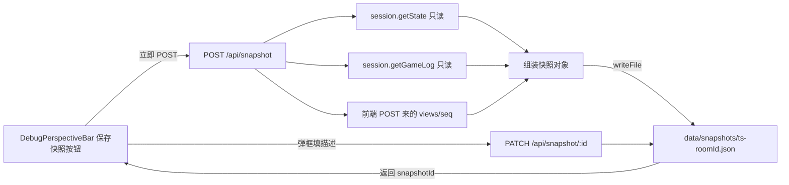

# Debug 模式快照功能 设计

> 日期:2026-06-24(定稿)
> 目标:在 debug 模式增加"保存快照"功能。发现 bug 时点击按钮,把前后端完整游戏状态
> 保存到 `data/snapshots/` 目录,供 AI 审查。要求不干扰正常游戏逻辑(只读旁路),完整反映游戏状态。

## 一、设计依据

### 1.1 用户诉求

调试三国杀引擎时,发现 bug 后只能口述现象给 AI。缺少一份能完整复现现场的状态快照,
导致审查依赖猜测。需要一个按钮:点击即把前后端状态冻结保存到本地 `data/` 目录,不用下载,
AI 直接读取即可分析。

### 1.2 现有架构可复用点

- **后端状态权威源**:`GameSession` 持有 `GameState`(players/hand/equipment/pendingSlots/...)
  + `ActionLogEntry[]`(确定性重放源)+ `atomHistory`(含 viewEvents 分叉)。已有公开 getter
  `getState()` / `getGameLog()`,无需改 session。
- **持久化先例**:`persistence.ts` 已有 `sanitizeState`(剥离 `onStateChange`/定时器等不可序列化字段)
  + `writeFile` 到 `data/rooms/`。快照复用 `sanitizeState`,写独立目录 `data/snapshots/`。
- **REST 先例**:`app.ts` 已有 `/api/rooms/:id/log` 等 REST 端点,通过 `gameSessions.get(roomId)`
  访问 session。快照新增同类端点。
- **前端多座次 view**:`useDebugMultiConnection` 持 `views: Map<seat, GameView>`,各座次独立 view
  已在前端内存中,收集即遍历 Map。

### 1.3 关键约束

1. **不干扰正常逻辑 = 解耦**:引擎(`engine/`)零改动、`GameSession` 零改动。快照逻辑是挂在
   现有系统外部的只读旁路,不嵌入任何游戏逻辑内部。
2. **完整反映游戏状态**:全量 state + actionLog + atomHistory + 各座次 view + sessionSeed。
3. **先冻结后填描述**:点击按钮立即 POST 冻结快照(捕获此刻 state + views + seq),
   返回 snapshotId 后再弹框填描述 PATCH 回去——防止填描述的几秒里后端推进错过状态。

## 二、架构



### 2.1 采集对齐方案(方案 A)

前端触发,后端集中采集。前端 POST 时携带各座次 `frontendSeqs` + `frontendViews` + `perspective`,
后端在同一请求处理里同步读 `state.seq`(同一事件循环 tick,无 await 推进),组合写入。

**seq 对齐机制**:两端都记录 seq。

- 前端收集极快(读内存 Map,微秒级同步),不构成时间差。
- 真正的时间差是 POST 网络往返(本地几 ms)期间后端可能又 dispatch 了几条 atom。
  这个差异**无法消除但可显式记录**:`backendSeq - frontendSeq[i] = N 条未到达前端的操作`。
- **信息零丢失**:后端 `actionLog` + `atomHistory` 是单调追加的完整权威日志,
  审查时能确定性重放出任意时刻的 state。时间差只会让"前端实际渲染的画面"和
  "后端权威状态"有 N 条偏差,而这偏差本身是 bug 现场的一部分。

### 2.2 排除的方案

- **方案 B(前端采集全部)**:前端没有后端 `atomHistory`/`settlementStack`/`pendingSlots` 内部状态,
  无法完整反映引擎状态。排除。
- **方案 C(后端定时/条件触发)**:不符合"发现 bug 后手动点按钮"诉求。排除。

## 三、快照文件格式

文件路径:`data/snapshots/<时间戳>-<roomId>.json`
示例:`data/snapshots/20260624T153012-test-room-cnugxt.json`

```jsonc
{
  "meta": {
    "snapshotId": "20260624T153012-test-room-cnugxt",
    "roomId": "test-room-cnugxt",
    "roomName": "...",
    "createdAt": 1719231012000,
    "description": null,          // 初始为 null,PATCH 后填入
    "playerCount": 4,
    "debug": true,
    "engineVersion": "..."        // 取 package.json 版本,便于对照
  },
  "alignment": {
    "frontendSeqs": { "0": 42, "1": 41, "2": 42, "3": 40 },
    "backendSeq": 43,             // 后端收到请求时刻的 state.seq
    "backendCapturedAt": 1719231012000,
    "note": "backendSeq - frontendSeq[i] = 未到达该座次的事件数"
  },
  "backend": {
    "state": { /* sanitizeState(GameState):players/hand/equipment/pendingSlots/... */ },
    "actionLog": [ /* 完整 ClientMessage 日志,确定性重放源 */ ],
    "atomHistory": [ /* AppliedAtomEntry[],含 viewEvents 分叉 */ ],
    "sessionSeed": 1719200000000,
    "lastActivityAt": 1719231011000
  },
  "frontend": {
    "perspective": 1,             // 点按钮时的当前视角座次
    "views": {                    // 各座次前端实际渲染的 GameView
      "0": { /* GameView for seat 0 */ },
      "1": { /* GameView for seat 1 */ }
    }
  }
}
```

**关键设计点**:
- `backend.state` 用 `sanitizeState` 剥离 `onStateChange`/定时器等不可序列化字段——复用现有逻辑。
- `actionLog` + `atomHistory` 都存:前者是重放源,后者含 viewEvents 分叉(排查"某座次看到的事件序列"用得上)。
- `alignment` 块让 seq 差异显式可读——审查时能立刻判断"前端是否落后于后端"。
- `frontend.views` 存前端实际渲染的 view——排查渲染 bug 必需。

## 四、后端接口设计

新增两个 REST 端点,契合现有 `app.get/post` 模式。

### 4.1 创建快照

```
POST /api/snapshot
Body: {
  roomId: string,
  perspective: number,
  frontendSeqs: Record<string, number>,
  frontendViews: Record<string, GameView>
}
Response 200: { snapshotId: string }
Response 404: { error: "会话不存在" }
Response 403: { error: "仅 debug 模式可用" }
```

处理流程(同步、只读):
1. `gameSessions.get(roomId)` 取 session;不存在返回 404
2. 校验 session 的 `debug` 标志;非 debug 返回 403(防止正式局误用)
3. `session.getState()` 读 state(已有公开方法);`session.getGameLog()` 读 actionLog
4. 直接读 `state.atomHistory`、`state.seq`
5. 组装快照对象,`sanitizeState` 剥离不可序列化字段
6. `writeFile` 到 `data/snapshots/`,返回 snapshotId

### 4.2 追加描述

```
PATCH /api/snapshot/:id
Body: { description: string }
Response 200: { success: true }
Response 404: { error: "快照不存在" }
```

读文件 → 更新 `meta.description` → 覆写回去。

### 4.3 文件组织

- 新增 `src/server/snapshot.ts`:存放这两个端点的处理函数(与 `persistence.ts` 平级)。
- `app.ts` 里注册路由(与 `/api/rooms/:id/log` 平级)。
- `persistence.ts` 的 `sanitizeState` 改成 `export`(现在模块私有)——这是复用而非耦合,
  它本就是为"序列化 state"存在的工具函数。

## 五、前端交互设计

### 5.1 按钮位置

`DebugPerspectiveBar`(顶部视角控制栏)。这里已有视角切换/跳转/删除房间按钮,
加一个"保存快照"按钮最自然,且仅在 debug 模式出现。

### 5.2 交互流程

```
点"保存快照"按钮
  → 立即从 conn.views 收集 frontendSeqs(各座次 view 的 lastSeq)+ frontendViews + perspective
  → POST /api/snapshot(按钮显示"保存中…"禁用态,防止连点)
  → 收到 snapshotId
  → 弹一个轻量输入框(inline),输入描述
  → PATCH /api/snapshot/:id { description }
  → 显示"已保存到 data/snapshots/xxx.json"提示
```

### 5.3 实现分工

- 新增 `src/client/hooks/useSnapshot.ts`:封装 POST 创建 + PATCH 描述的 fetch 逻辑 + loading/error 状态。
- `DebugPerspectiveBar` 增加 `onSaveSnapshot` prop 和"保存快照"按钮。
- `DebugGameViewInner` 把 `conn.views`、`perspective` 传给 `useSnapshot`,组合成 `onSaveSnapshot` 回调传给 `DebugPerspectiveBar`。
- 描述输入用项目现有 UI 模式(inline 输入框,复用 `gameViewStyles` 的按钮/输入样式)。

### 5.4 不干扰正常逻辑的保障

- 快照操作不触碰 `conn` 的 WS 连接、不调 `sendAction`、不改 React 渲染状态树。
- loading 期间按钮禁用,避免并发快照。
- 快照失败用 toast 提示,不抛错中断游戏。

## 六、解耦边界(核心约束的专项设计)

"不干扰正常逻辑"的核心语义是**解耦,不是性能**。快照逻辑不该侵入引擎/session 的正常游戏代码路径。

| 边界 | 保障措施 |
|------|---------|
| **引擎零改动** | `engine/` 目录下所有文件(types.ts、create-engine.ts、atoms/、skills/)**一行都不动**。快照只通过 session 已暴露的公开 getter 读取,引擎不感知快照功能存在。 |
| **session 零改动** | `GameSession` 类**不加方法、不加字段**。快照处理函数在 app.ts 用 `gameSessions.get(roomId)` 拿到 session 后调已有 getter,session 内部不知快照这回事。 |
| **新增代码隔离** | 所有快照逻辑集中在两个新文件 `src/server/snapshot.ts`(后端)+ `src/client/hooks/useSnapshot.ts`(前端),外加 `DebugPerspectiveBar` 加一个按钮。正常游戏逻辑文件(reducer、引擎、session 的 dispatch 路径)完全不触碰。 |
| **唯一例外** | `persistence.ts` 的 `sanitizeState` 改成 `export`(现在模块私有),复用而非耦合。 |

一句话:**快照功能是挂在现有系统外部的只读旁路,不嵌入任何游戏逻辑内部**。

## 七、其他安全边界

| 维度 | 保障措施 | 验证方式 |
|------|---------|---------|
| **网络层** | 快照走独立 REST 端点,不经 WS 消息处理(`handleWsMessage`),不占用游戏消息通道。 | 接口隔离即可见 |
| **持久化** | 快照写 `data/snapshots/`,与 `data/rooms/` 完全隔离。不影响 `persistence.ts` 的 debounce 写房逻辑。 | 目录隔离即可见 |
| **文件 I/O 异常** | `writeFile` 失败时 catch,返回 500 + toast,不 crash session。 | 错误路径测试 |
| **内存** | 快照对象组装完即释放(请求作用域),不缓存。 | 无泄漏设计 |
| **debug 限制** | `POST /api/snapshot` 校验 session 的 `debug` 标志,非 debug 返回 403。 | 接口校验 |

**边界明确**:
- 快照**不暂停**游戏——后端 dispatch 仍可能在 POST 处理期间推进。这正是 `alignment.seq` 块要记录的,不是缺陷。
- 快照**不触发**持久化——它是一次性导出,不进 `data/rooms/` 的 debounced 写房流程。

## 八、测试与验收

### 8.1 后端测试(`tests/server/snapshot.test.ts`)

- 创建快照:session 存在时返回 snapshotId + 文件落盘 + 文件结构含四块(meta/alignment/backend/frontend)
- 创建快照:session 不存在返回 404
- 创建快照:非 debug session 返回 403
- 创建快照后 state 引用/seq **不变**(验证只读、不干扰)
- 追加描述:PATCH 后文件 meta.description 更新
- 追加描述:snapshotId 不存在返回 404

### 8.2 前端测试

- `useSnapshot` hook:POST 请求体正确、loading 态切换、错误时不抛
- 按钮渲染:仅在 debug 模式出现

### 8.3 验收标准(端到端手动验证)

1. 开 debug 房间,玩几轮产生状态
2. 点"保存快照"→ 文件出现在 `data/snapshots/`
3. 文件能被完整解析,含前后端状态 + seq 对齐
4. 快照期间游戏操作不中断(继续出牌/响应正常)
5. 填描述后文件更新

## 九、改动清单

### 后端

| 文件 | 改动 |
|---|---|
| `src/server/snapshot.ts` | **新建**:POST /api/snapshot + PATCH /api/snapshot/:id 处理函数 |
| `src/server/app.ts` | 注册两个新路由 |
| `src/server/persistence.ts` | `sanitizeState` 改为 `export` |

### 前端

| 文件 | 改动 |
|---|---|
| `src/client/hooks/useSnapshot.ts` | **新建**:POST 创建 + PATCH 描述的 fetch 逻辑 |
| `src/client/components/DebugPerspectiveBar.tsx` | 增加 `onSaveSnapshot` prop + 按钮 |
| `src/client/components/DebugLobby.tsx` | `DebugGameViewInner` 接入 useSnapshot,传回调给 DebugPerspectiveBar |

### 测试

| 文件 | 改动 |
|---|---|
| `tests/server/snapshot.test.ts` | **新建**:后端接口测试 |

## 十、实施顺序

1. 后端:`persistence.ts` 导出 `sanitizeState`
2. 后端:`snapshot.ts` 新建,实现创建快照处理函数
3. 后端:`app.ts` 注册 POST 路由
4. 后端:`snapshot.ts` 实现追加描述处理函数 + PATCH 路由
5. 后端测试:`snapshot.test.ts` 覆盖 6 个用例
6. 前端:`useSnapshot.ts` 新建
7. 前端:`DebugPerspectiveBar` 加按钮
8. 前端:`DebugLobby` 接入
9. 端到端手动验证
