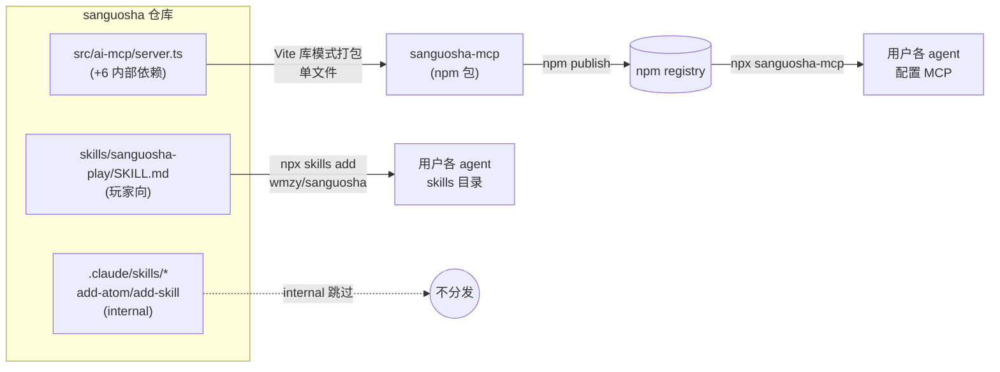

# AI 工具分发体系设计

> 创建日期: 2026-06-27
> 状态: 设计待实现
> 关联: `2026-06-26-ai-player-mcp-design.md`（MCP server 本体）

## 一、目标与背景

把三国杀的 AI 工具（MCP server + 玩家向 skill）从「硬编码在本仓库根目录、仅 Claude Code 可用」改造成**可跨 agent 安装分发**的形态。

**现状问题**：

- `.mcp.json` 写死在仓库根 → 只有 Claude Code 自动读取，Cursor / Codex / Windsurf 各有自己的配置路径，拿不到。
- `.claude/skills/add-atom`、`add-skill` 写死在 `.claude/skills/` → 同样只有 Claude Code 加载。
- 仓库内的 MCP server 从源码运行（`npx tsx src/ai-mcp/server.ts`），依赖本仓库源码树 + 本机游戏服务器，外部用户无法直接用。

**已与用户确认的关键决策**：

- **目标受众**：外部独立用户（不克隆本仓库源码）。
- **游戏服务器**：连接用户维护的**公开托管服务器**（`SGS_SERVER_URL` 可覆盖）。
- **Skill 内容**：新建**玩家向** skill（教 agent 用 MCP 玩游戏 + 规则速查）；现有 `add-atom`/`add-skill` 是引擎开发技能，**不对外分发**。
- **打包形态**：MCP 打包成**单个文件**，构建期生成 `package.json`，包名 `sanguosha-mcp`，**只用 Vite**（不引入额外打包工具）；skill 发布走 `npx skills`。

## 二、现实约束（关键发现，决定方案形态）

### 2.1 `npx skills` 只装 skill，不装 MCP

读 `vercel-labs/skills`（npm 包 `skills`，即 `npx skills`）源码确认：

- `src/skills.ts` 的 `discoverSkills()` **只扫描 `SKILL.md`**（发现路径：仓库根、`skills/`、`.claude/skills/`、`.agents/skills/` 等 `AGENT_PROJECT_SKILL_DIRS`），**完全不处理 `.mcp.json` / MCP server**。
- `src/add.ts` / `src/install.ts` 全程围绕 SKILL.md 安装，无任何 MCP 配置写入逻辑。

> 结论：**「一条 `npx skills` 命令同时装 skill + MCP」在技术上做不到**。Skill 走 `npx skills`；MCP 必须各 agent 独立配置（Claude Code 用 `claude mcp add` / `.mcp.json`、Cursor 用 `.cursor/mcp.json` 等）。`vercel-labs/open-plugin-spec` 虽把 `.mcp.json` 定义为 plugin 组件，但 `skills` CLI 并未实现 MCP 安装，只有「plugin host」会读，而 `skills` CLI 不是 host。

### 2.2 `metadata.internal: true` 安全（不影响本仓库 Claude Code 开发）

`npx skills add wmzy/sanguosha` 会扫描到 `.claude/skills/`，需把开发 skill 排除。计划给 `add-atom`/`add-skill` 加 `metadata.internal: true`。核实安全性：

- `skills.ts` 的 `parseSkillMd()` 默认跳过 `metadata.internal === true`（除非 `INSTALL_INTERNAL_SKILLS=1`）→ 外部用户只拿到玩家 skill。✅
- Claude Code 运行时**只消费运行时 frontmatter**（`name`/`description`/`when_to_use`/`allowed-tools`/`disable-model-invocation` 等），非运行时 metadata（含 `metadata.internal`、catalog flag）**被忽略/剥离**（anthropics/claude-code issue #13005 确认）。→ 本仓库 Claude Code 开发加载 `add-atom`/`add-skill` 不受影响。✅

## 三、方案概述

两条分发线，各用其标准工具：



| 线 | 工具 | 用户命令 | 产出位置 |
|---|---|---|---|
| MCP | npm 包 `sanguosha-mcp` | 各 agent 配置 `npx sanguosha-mcp` | agent 各自 MCP 配置 |
| Skill | `npx skills`（标准生态） | `npx skills add wmzy/sanguosha --skill sanguosha-play` | agent skills 目录 |

## 四、详细设计

### 4.1 MCP 包 `sanguosha-mcp`（Vite 单文件打包）

**构建配置** `vite.mcp.config.ts`（仓库根，与前端 `vite.config.ts` 分离）：

```ts
import { defineConfig } from 'vite';

export default defineConfig({
  build: {
    lib: {
      entry: 'src/ai-mcp/server.ts',
      formats: ['es'],
      fileName: () => 'sanguosha-mcp.mjs',
    },
    outDir: 'dist/sanguosha-mcp',
    minify: false,            // 保留可读性，MCP server 无需压缩
    rollupOptions: {
      // node 内置模块外置；ws 的可选原生加速模块外置（缺失时 ws 自动回退纯 JS）
      external: [/^node:/, 'bufferutil', 'utf-8-validate'],
      output: { banner: '#!/usr/bin/env node' },  // bin 入口 shebang
    },
  },
});
```

**打包范围**：入口 `src/ai-mcp/server.ts` + 6 个内部依赖全部打进单个 `sanguosha-mcp.mjs`：

- `src/client/headless/HeadlessGameClient`、`src/client/headless/types`
- `src/client/utils/pendingRespond`
- `src/engine/skill`、`src/engine/types`
- `src/server/protocol`

外加第三方 `ws`（CJS，Vite/Rollup 自动 interop 打包）。Node 内置（`node:readline` 等）外置。

**构建脚本** `scripts/build-mcp.mjs`：

1. 调 `vite build --config vite.mcp.config.ts` 生成 `dist/sanguosha-mcp/sanguosha-mcp.mjs`。
2. 生成 `dist/sanguosha-mcp/package.json`：
   ```json
   {
     "name": "sanguosha-mcp",
     "version": "<见 4.1.1 版本管理>",
     "type": "module",
     "bin": { "sanguosha-mcp": "./sanguosha-mcp.mjs" },
     "engines": { "node": ">=22" }
   }
   ```
3. 生成 `dist/sanguosha-mcp/README.md`（安装说明精简版，指向主仓库完整文档）。

**主 `package.json` 新增脚本**：`"build:mcp": "node scripts/build-mcp.mjs"`。**不新增任何打包工具依赖**（Vite 已在）。

**发布**：`pnpm build:mcp && npm publish dist/sanguosha-mcp`。

**`SGS_SERVER_URL` 默认值**：`src/ai-mcp/server.ts` 改为读 `process.env.SGS_SERVER_URL ?? __SGS_DEFAULT_URL__`（去掉硬编码 localhost）。`vite.mcp.config.ts` 用 `define` 注入 `__SGS_DEFAULT_URL__`：

```ts
define: {
  __SGS_DEFAULT_URL__: JSON.stringify(process.env.SGS_PUBLIC_URL ?? ''),
}
```

本仓库开发跑 `pnpm mcp:serve`（tsx 直接跑源码）时 `__SGS_DEFAULT_URL__` 未定义 → 在 server.ts 顶部加 `declare const __SGS_DEFAULT_URL__: string | undefined;` 并兜底 `?? 'ws://localhost:3930/ws'`。发布时维护者 `SGS_PUBLIC_URL=wss://<公开服务器>/ws pnpm build:mcp` 注入默认值；用户仍可用 `SGS_SERVER_URL` env 覆盖。

#### 4.1.1 版本管理

主 `package.json` 版本为 `0.0.0`（游戏本体，非发布物）。`sanguosha-mcp` 包版本**独立管理**：

- `scripts/build-mcp.mjs` 读 `process.env.MCP_VERSION`，缺省 `0.1.0`。
- 发布前 `MCP_VERSION=0.1.0 pnpm build:mcp` → `npm publish`。
- 后续发版 bump 该 env（或后续引入 `changeset`，一期不做）。

### 4.2 玩家向 skill `skills/sanguosha-play/SKILL.md`

**位置**：仓库根 `skills/sanguosha-play/SKILL.md`（`skills/` 是 Agent Skills 标准发现路径）。

**frontmatter**：

```yaml
---
name: sanguosha-play
description: 用 sanguosha MCP server 操作三国杀对局——开局、出牌决策、技能/卡牌查询。当用户想通过 AI agent 玩或测试三国杀时使用。
---
```

**正文内容**：

1. **前置：配置 sanguosha MCP**——指向 `npx sanguosha-mcp` + 设 `SGS_SERVER_URL`（链接到主仓库安装文档）。
2. **工具说明**：
   - `play`：动作-观察循环（执行操作 → 阻塞等轮到自己或游戏结束 → 返回 view + availableActions）。首次 `play({ startGame: true })` 开局。
   - `getSkillInfo`：按名称查询技能/卡牌效果描述。
3. **三国杀规则速查**：回合流程（摸牌→出牌→弃牌）、基本牌（杀/闪/桃）、常见锦囊（决斗/南蛮/万箭/无中生有/过河拆桥/顺手牵羊/无懈可击/桃园/五谷）、装备（武器加射程/防具减伤/马调距离）、身份目标。
4. **决策建议**：优先级（救命>输出>过牌）、availableActions 用法（选一条 + 补 targets）、典型错误（目标不合法 / 出杀超次 / 弃牌不足）。
5. **典型对局流程**：startGame → 选将 → 循环 play 直到 `gameOver`。

### 4.3 开发 skill 标 internal

`.claude/skills/add-atom/SKILL.md`、`.claude/skills/add-skill/SKILL.md` 的 frontmatter 各加：

```yaml
metadata:
  internal: true
```

效果（见 §2.2）：skills CLI 默认跳过 → 外部 `npx skills add` 只装 `sanguosha-play`；Claude Code 本地开发加载不受影响。

### 4.4 安装文档

`README.md` 新增「AI agent 接入」章节，含两条线：

**MCP（按 agent）**：

- Claude Code：`claude mcp add sanguosha -- npx -y sanguosha-mcp`，或项目 `.mcp.json`：
  ```json
  { "mcpServers": { "sanguosha": { "command": "npx", "args": ["-y", "sanguosha-mcp"], "env": { "SGS_SERVER_URL": "wss://<公开服务器>/ws" } } } }
  ```
- Cursor：写入 `~/.cursor/mcp.json`（同上结构）。
- Windsurf：写入 `~/.codeium/windsurf/mcp_config.json`。
- Codex：按其 config 写入。

**Skill**：

```bash
npx skills add wmzy/sanguosha --skill sanguosha-play
# 或交互式选择
npx skills add wmzy/sanguosha
```

**环境变量**：`SGS_SERVER_URL`（必填，公开服务器地址）、可选 `SGS_ROOM_ID`/`SGS_SEAT`/`SGS_PLAYER_COUNT`。

### 4.5 仓库自身

- `.mcp.json` **保留**（本仓库 Claude Code 开发用，指向 `ws://localhost:3930/ws`，从源码运行）。
- `dist/sanguosha-mcp/` 加入 `.gitignore`（构建产物，不入库）。
- 现有 `pnpm mcp:serve`（从源码跑 MCP，本仓库开发用）保留。

## 五、文件清单

| 操作 | 文件 | 说明 |
|---|---|---|
| 新增 | `vite.mcp.config.ts` | MCP 单文件打包配置 |
| 新增 | `scripts/build-mcp.mjs` | 构建 + 生成 package.json/README |
| 新增 | `skills/sanguosha-play/SKILL.md` | 玩家向 skill |
| 改 | `.claude/skills/add-atom/SKILL.md` | 加 `metadata.internal: true` |
| 改 | `.claude/skills/add-skill/SKILL.md` | 加 `metadata.internal: true` |
| 改 | `package.json` | 加 `build:mcp` 脚本 |
| 改 | `README.md` | 加「AI agent 接入」章节 |
| 改 | `.gitignore` | 加 `dist/sanguosha-mcp/` |

## 六、验收标准

1. `pnpm build:mcp` 产出 `dist/sanguosha-mcp/sanguosha-mcp.mjs`（单文件、带 shebang）+ `package.json`（name=`sanguosha-mcp`、bin 正确）。
2. `node dist/sanguosha-mcp/sanguosha-mcp.mjs` 能启动 stdio JSON-RPC（连公开服务器时 `initialize` / `tools/list` 正常响应；本机验证用 `SGS_SERVER_URL=ws://localhost:3930/ws` 起服务端后测）。
3. `npx skills add wmzy/sanguosha --list`（在临时 clone 上）只列出 `sanguosha-play`，**不含** `add-atom`/`add-skill`。
4. 本仓库 Claude Code 仍正常加载 `add-atom`/`add-skill`（加 internal 后无变化）。
5. README「AI agent 接入」章节覆盖 Claude Code / Cursor / Windsurf 的 MCP 配置 + skill 安装命令。

## 七、非目标（YAGNI）

- **不做 MCP 自安装器**（用户明确「提供安装文档即可」）——文档给各 agent 配置片段。
- **不发布引擎为独立 npm 包**——MCP 单文件 bundle 已内含所需引擎/客户端代码。
- **不迁移/改造现有 `.claude/skills/` 开发 skill 位置**——仅加 internal 标记。
- **不做公开服务器部署**——服务器由用户维护，本设计只约定 `SGS_SERVER_URL` 契约。
- **不引入 changeset/额外打包工具**（项目是单包，不是 monorepo，不需要 changeset）。

## 八、风险与决策记录

| 风险/决策 | 处理 |
|---|---|
| `ws`（CJS）打包进 ESM 单文件 | Vite/Rollup 自动 interop；可选原生模块（`bufferutil`/`utf-8-validate`）外置，缺失时 ws 回退纯 JS。构建后冒烟测试 `tools/list` 验证。 |
| `npx skills` 不能装 MCP（用户原诉求） | 如实告知现实约束；skill 走 `npx skills`，MCP 走各 agent 配置 + 文档。这是 skills CLI 的固有限制，非本设计可绕过。 |
| 公开服务器 URL 未知 | 包默认值由构建脚本注入；文档要求用户设 `SGS_SERVER_URL`。一期用占位/文档约定。 |
| 版本号管理 | `MCP_VERSION` env，缺省 `0.1.0`；后续按需引入 changeset。 |
| Claude Code 是否真的忽略 `metadata.internal` | 已核实（issue #13005 + 多源）：运行时只消费运行时字段。验收 §6.4 再次确认。 |
